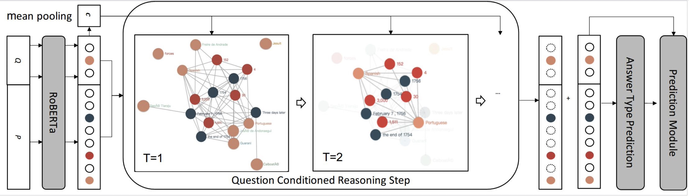

# QDGAT (Question Directed Graph Attention Network for Numerical Reasoning over Text)

# Framework

# Prepare:

- Download the CoreNLP tools from https://stanfordnlp.github.io/CoreNLP/
- Using CoreNLP tools to parse drop passages and questions (You can use the properties file `corenlp.properties`)
- Run `parse_xml.py` to parse the xml from Step 1, and generate the data file for training.

# Usage:
- Execute the `run.sh` directly, which will do:
  - Parse drop data and find valid solutions for each drop question, and load data as batch.
  - Load QDGATNet model.
  - Run train and evaluate.
